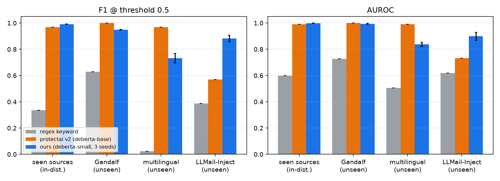
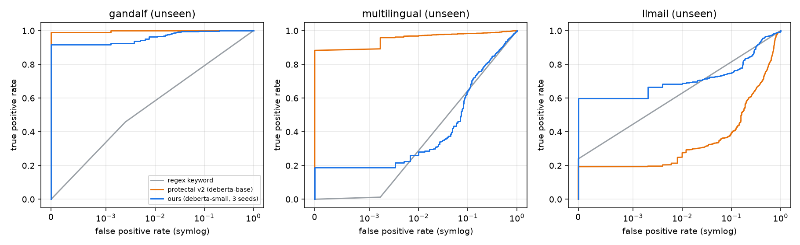
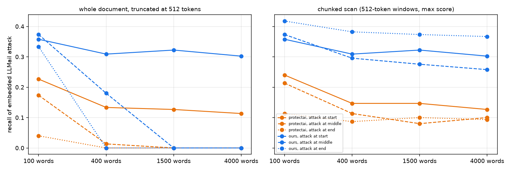
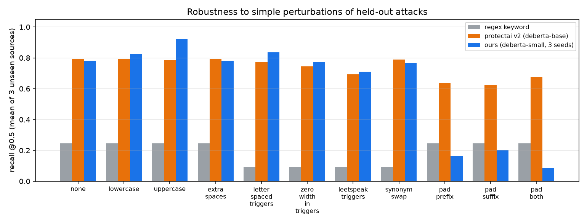

# LLM Firewall — a prompt-injection detector that generalizes to indirect injection

A small, fast classifier that flags **prompt-injection attacks** before an AI agent acts on them — including the harder, realistic case of **injections hidden inside documents an agent reads** (emails, web pages, retrieved text).

**One-line result:** on indirect injection embedded in emails (the LLMail benchmark), this 142M-parameter model scores **F1 0.88** versus **0.57** for the widely-used open guard model `protectai/deberta-v3-base-prompt-injection-v2` — because the existing model, though strong on direct attacks, does not generalize to injections buried in content. On the attack types the existing model was trained for, it remains ahead. This repo reports both, honestly.

## Why this matters
AI agents increasingly read untrusted content — emails, web pages, tool outputs — and an attacker can hide instructions there ("indirect prompt injection"). A guard that only catches *direct* "ignore your instructions" prompts gives a false sense of safety. The interesting, safety-relevant question is **generalization to unseen attack sources and to indirect injection**, which is what this project measures.

## Method
- **Model:** `microsoft/deberta-v3-small` (142M params), fine-tuned as a binary classifier (injection vs benign), 3 epochs, lr 3e-5, max_len 256. Trained with **3 seeds**; all numbers are seed means.
- **The key design choice — source-held-out evaluation.** We do *not* report a random train/test split (which overstates real-world performance). We train on some attack sources and test on **entirely unseen** ones:
  - **Train:** deepset, SPML (held-out system-prompt groups excluded), jackhhao.
  - **Unseen test:** Gandalf, a multilingual set, and **LLMail** (indirect injection in emails, from the LLMail-Inject competition).
  - **Benign pools (all held out):** Dolly instructions, CNN/DailyMail articles (web-style text), multilingual Wikipedia snippets, and templated emails — each measured for false alarms separately.
- **Baselines:** `protectai/deberta-v3-base-prompt-injection-v2` (a popular open guard model) and a hand-written keyword/regex filter.

## Results (seed-averaged, threshold 0.5)

| Test suite | Model | Precision | Recall | F1 | AUROC | FPR |
|---|---|---|---|---|---|---|
| Seen attacks | keyword | 0.970 | 0.204 | 0.337 | 0.599 | 0.007 |
| | protectai | 0.975 | 0.964 | 0.969 | 0.991 | 0.027 |
| | **ours** | 0.996 | 0.986 | **0.991** | 0.999 | 0.004 |
| Unseen — Gandalf | protectai | 0.999 | 1.000 | 0.999 | 1.000 | 0.001 |
| | **ours** | 0.999 | 0.904 | 0.949 | 0.994 | 0.001 |
| Unseen — multilingual | protectai | 0.954 | 0.982 | 0.968 | 0.991 | 0.077 |
| | **ours** | 0.907 | 0.617 | 0.732 | 0.837 | 0.104 |
| **Unseen — indirect injection in emails (LLMail)** | keyword | 1.000 | 0.240 | 0.387 | 0.620 | 0.000 |
| | protectai | 0.942 | 0.409 | 0.570 | 0.732 | 0.120 |
| | **ours** | 0.955 | 0.820 | **0.882** | 0.899 | 0.184 |




**Reading the table honestly:**
- **Indirect injection (LLMail) is the headline:** ours F1 **0.88** vs protectai **0.57**. protectai catches only 41% of injections hidden in emails; ours catches 82%. This is the agent-relevant threat.
- **protectai wins on multilingual and Gandalf.** Ours is English-trained, so multilingual recall drops (0.62); and protectai very likely trained on Gandalf-style data (it scores a near-perfect 1.000 there), so that comparison is not clean in its favor.
- **Cost:** ours trades a higher false-alarm rate on emails (FPR 0.184 vs 0.120) for its much higher recall. A deployment could raise the threshold to trade recall back for fewer false alarms (see `results/threshold_sweep.png`).

### Indirect injection in long documents
We inject an attack at the start / middle / end of 100–4000-word documents and measure detection, truncated vs chunked scanning.

Both models lose recall as the injection is buried in more text, but **protectai collapses toward zero** (e.g. ~0.01–0.15 recall at 400 words) while **ours degrades gracefully** and **chunked scanning recovers recall** (e.g. 100w, injection at end: 0.33 truncated → 0.42 chunked). Takeaway: scan long inputs in chunks, and even then detection of deeply-buried injection is an open problem.

### Robustness to simple evasions

Ours stays strong under lowercasing, extra spaces, and letter-spacing of triggers (Gandalf recall ~0.90–0.94), but **uppercasing raises its false-alarm rate** (FPR ~0.08) — a real weakness. protectai is more perturbation-stable on the sources it knows.

## Limitations (read before trusting any number)
- **Benign/positive source mismatch.** Positives and benign examples come from different datasets, so a classifier can exploit source artifacts. Treat absolute FPRs as optimistic.
- **Synthetic benign emails.** No clearly-licensed benign-email corpus exists, so the 500 benign emails are templated. The LLMail false-alarm rate is therefore optimistic / shortcut-prone.
- **Possible training overlap for the baseline.** `protectai` may have trained on the "seen" and Gandalf sources, which is why it scores near-perfect there. **Only the unseen suites (especially LLMail and multilingual) are a fair comparison.**
- **LLMail is a competition dataset** with its own distribution quirks; it is one benchmark, not the universe of indirect injection.
- **The keyword baseline is hand-written** and is meant only as a naive floor.
- English-centric training; multilingual coverage is weak.

## Reproduce
```bash
pip install -r requirements.txt
python data/prepare.py            # builds source-held-out splits (licenses checked)
python baselines.py               # keyword + protectai
python train.py --seed 0          # repeat for seeds 1, 2
python eval.py                    # writes results/eval.json + plots
python app.py                     # local Gradio demo (127.0.0.1)
```

## Demo
`app.py` is a Gradio app: paste text to get a risk score, or use the "agent reads a poisoned document" tab (`examples/scenarios.json`). It runs locally and binds to 127.0.0.1.

## Model card (summary)
- **Base:** microsoft/deberta-v3-small (MIT). **Task:** binary prompt-injection detection. **Input:** up to 256 tokens. **Output:** injection probability.
- **Training data:** deepset (Apache-2.0), SPML (MIT), jackhhao (Apache-2.0) for positives; Dolly (CC-BY-SA-3.0) and CNN/DailyMail (Apache-2.0) for negatives.
- **Intended use:** a defensive pre-filter for agent inputs, as one layer of defense — not a sole guarantee. **Out of scope:** adversarially-optimized attacks, languages beyond its training mix, and injection buried deep in long documents (scan in chunks).
- **Ethics:** uses only public attack datasets; authored no new attack content.

## Data licenses
deepset (Apache-2.0), reshabhs/SPML (MIT), jackhhao (Apache-2.0), Lakera/gandalf_ignore_instructions (MIT), yanismiraoui multilingual (Apache-2.0), microsoft/llmail-inject-challenge (MIT), databricks-dolly-15k (CC-BY-SA-3.0), cnn_dailymail (Apache-2.0), wikimedia/wikipedia (CC-BY-SA). Code: MIT (see LICENSE).
